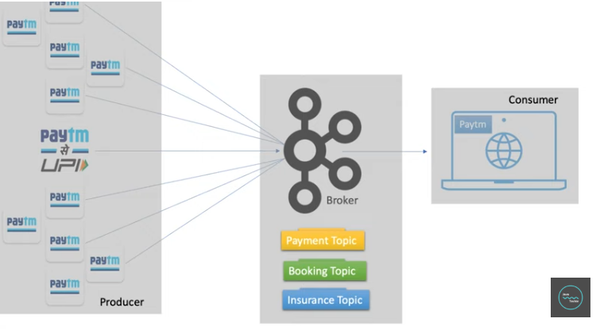
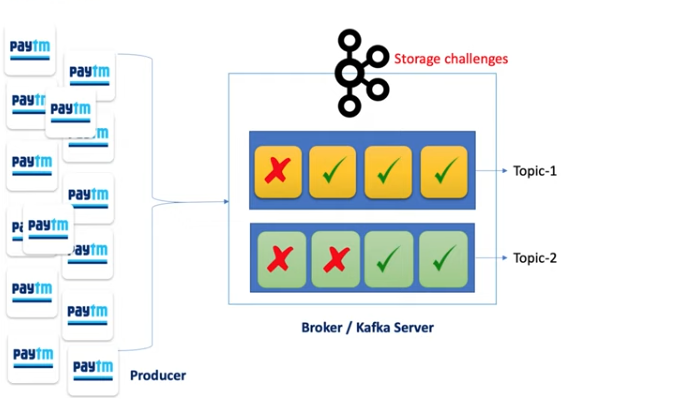
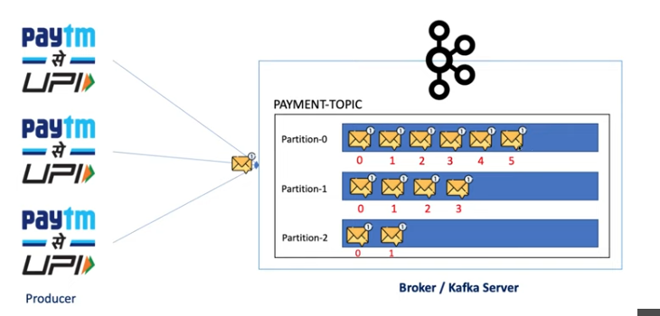
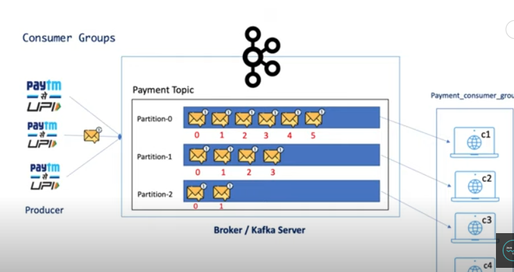
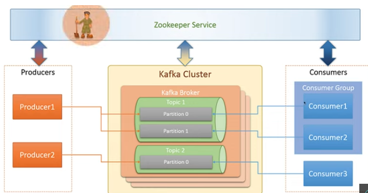

[link for kafka overview](https://medium.com/@bhageshwaridevnani/understanding-apache-kafka-a-beginners-guide-340ab3d1ebd0)

[link for kafka architecture]()

## Kafka Basics : Everything You Need To Know About Apache Kafka
Demystifying Kafka: An In-Depth Guide to Understanding Apache Kafka.

“In this article, I will provide an in-depth overview of Apache Kafka and its architecture components to help you gain a deeper understanding of this powerful event-streaming platform.”

#### What is Apache Kafka?

Apache Kafka is an open-source distributed event streaming platform that serves two distinct purposes given below.

1. Creating Real-Time Streams: Imagine Google Pay, where lots of people are buying things at once. All those transactions create a flood of information. Kafka helps by quickly sending all that data to a central place, almost like a continuous data stream.

2. Processing Real-Time Streams: Once the data arrives at this central place (Kafka), other servers (like Google Pay’s servers) need to check if everything’s okay, like making sure transactions are valid and within limits. They do this by listening to the data stream and making decisions in real time.

Kafka’s distributed nature offers significant advantages. It allows for the distribution of Kafka servers across different regions to facilitate event-streaming operations. This ensures that if one server goes down, the traffic can seamlessly transition to an available server, minimizing application downtime.

The Kafka streaming process
It’s worth noting that Kafka originally originated at LinkedIn.

#### Why do we need Kafka?

Imagine you have two applications, let’s call them App1 and App2. When App1 needs to send a message to App2, it can be a problem if App2 is not available at that moment. In such cases, the message might be lost in transit.

However, Kafka comes to the rescue. When App1 sends a message to App2 via Kafka, even if App2 isn’t ready to receive it immediately, Kafka stores the message safely. When App2 becomes available, it can retrieve the message from Kafka. This ensures that no data gets lost in the process.

Kafka is necessary when your application is large or complex, with many servers connected to each other. Communicating in such a scenario can be challenging. There are several challenges to address, such as data formatting complexity, connection types, and the high number of connections.

#### Data Formatting Complexity:- 
In big applications, you often deal with various types of data in different formats or schemas. Managing this complexity can be challenging.

* Connection Types:- 
These applications use different types of connections, like HTTP, JDBC, TCP, and more. Coordinating and managing these diverse connections across various services can be quite complex.

* Number of Connections:- 

When you have multiple servers connecting to each other, the number of connections can explode quickly. For example, if one server is connected to five others, and you have four such servers, you’re dealing with 20 connections to manage.

* Without Kafka complexity

But Kafka simplifies everything. Senders can use any type of data or connection (like HTTP, TCP, JDBC) to Kafka. Kafka securely stores the data. Receivers can then retrieve the data from Kafka. This simplifies communication and reduces the number of connections required.

Add Kafka between servers for communication

#### How does Kafka work?

Kafka operates on a Pub/Sub (Publisher-Subscriber) model. It functions as a communication system that enables different parts of a computer system to exchange data through the publication and subscription to topics. Here’s how it works:-

Imagine Kafka as a central hub for messages and data.
When a sender (the publisher) wants to send a message, it publishes it on a specific topic.
The receiver (the subscriber) is interested in that topic and subscribes to it.
Once subscribed, the receiver can directly receive the messages sent to that topic.
Kafka Architecture and Its Components

Kafka’s architecture consists of nine key components.

### 1. Producer:- 
The producer’s role is to create and send messages, essentially publishing them to Kafka.

### 2. Consumer:- 

Consumers are responsible for receiving and processing messages or events.

### 3. Broker:-

Brokers act as intermediaries between producers and consumers. They facilitate message exchange, ensuring messages reach their intended recipients.

Process of producer, consumer, and broker

### 4. Cluster:- 

A Kafka cluster is a group of computers or servers working together for a common purpose. Since Kafka is a distributed system, a Kafka cluster includes multiple Kafka servers or brokers. There can be one or more brokers in a Kafka cluster. This clustering ensures scalability and fault tolerance. For instance, if one broker can’t handle all the data produced, another can take over.

###### Kafka Cluster

#### 5. Topic:-

 A Kafka topic serves as a named channel or category where messages are published by producers and consumed by consumers. Topics are used to organize and categorize data within a Kafka cluster. They are identified by names, which are strings. Producers publish messages to specific topics, and consumers subscribe to one or more topics to consume messages.

 

### 6. Partitions:-
 Producers send data to brokers, and brokers store messages on different topics. If a producer generates a massive amount of data in a short time, a single topic may struggle to handle it. Kafka addresses this by dividing topics into partitions and distributing these partitions across multiple machines. This concept is known as topic partitioning, and each part is called a partition. The number of partitions for a topic can be decided when creating it.

 

Topic partition
7. Offset:- When a producer sends data to a broker, the data goes to a specific partition. The partition assigns a unique sequence number, called an offset, to each message. Offset helps consumers keep track of which messages they have consumed and where to resume consumption. For example, if a consumer reads messages 0 to 3 and then stops, it knows to start reading from the 4th offset when it resumes.

8. Consumer Groups:- Since there can be many partitions, a single consumer may not handle all of them efficiently. That’s why Kafka employs consumer groups. These groups consist of multiple consumer instances that work together. They share the workload and read from different partitions in parallel, improving throughput.

Consumer groups
#### 9. Zookeeper:- 
A zookeeper is a crucial component in the Kafka ecosystem. Kafka is a distributed system, and it relies on Zookeeper for coordination and tracking of the status of Kafka cluster nodes. Zookeeper also keeps track of Kafka topics, partitions, offsets, and more. In essence, Zookeeper serves as the manager for your Kafka cluster and brokers.

### how to install kafka cluster

*  sudo apt update && sudo get install nano tar nettools -y

* java --version

* sudo apt install openjdk-11-jdk -y

*  java --version

*  wget https://archive.apache.org/dist/kafka/3.4.0/kafka_2.12-3.4.0.tgz

*  ls

* tar xzvf kafka_2.12-3.4.0.

* mv kafka_2.12-3.4.0 kafka

* cd kafka/

* mkdir -p data/zookeeper

* cd config/

* ll

* vim zookeeper.properties 
(we did some changes like dataDir=/root/kafka/data/zookeeper ; commands.whightlist=*)

* cd /kafka/bin

* ./zookeeper-server-start.sh /root/kafka/config/zookeeper.properties

* ./zookeeper-server-start.sh -deamon /root/kafka/config/zookeeper.properties

* echo "ruok" | nc localhost 2181 ; echo  (it replies imok)

* 

  
